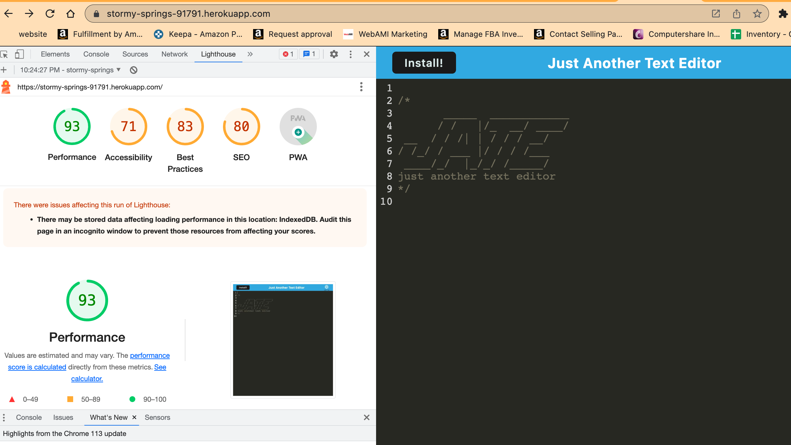
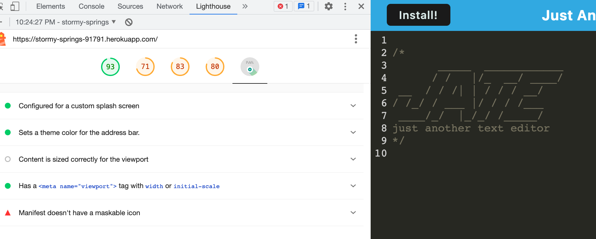

# PWA

## Description

This project demonstrated how to create a progressive web app.

## Installation

This project is deployed on Heroku at this address https://stormy-springs-91791.herokuapp.com/
To install it as a PWA just click on the Install button. It will save the application on your machine. On a Mac it will keep them in the Launchpad area. To delete the app, open it as a PWA and navigate to the three dots in the upper right, there should be an option to uninstall from within that.

## Usage

Have fun with the text editor!  

## License

MIT

## Contributing

Feel free to contribute!

## Credits

Thanks to eveyone at edX coding bootcamps and my classmates!

## Questions

Email me at bcebel@gmail.com or visit my github page https://github.com/bcebel if you have any questions.
